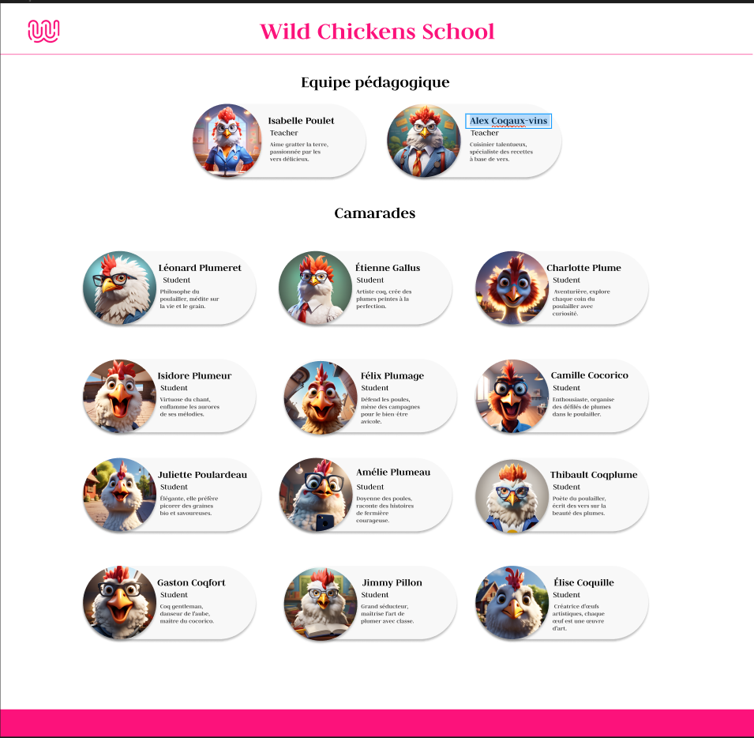

# Challenge de la WCS (Wild Chickens School)

Isabelle Poulet, la cheffe de projet bienveillante, s'approche de toi avec une plume d'or à la patte. Son regard réfléchi exprime une vision claire pour renforcer l'esprit d'équipe. Elle te confie la mission spéciale :

"Cher développeur en herbe, bienvenue dans l'équipe d'intégrateurs web! Nous avons besoin d'une page 'Team' qui reflète la diversité et la coopération qui règnent parmi nous. Ta mission, si tu l'acceptes, consiste à utiliser React pour façonner cette page avec créativité et précision.

Voici un exemple de ce que nous attendons ...

### Screenshot

\*tu peux personnaliser tes cards !

### Informations

La couleur préférée de la WCS est le "#fc127b"
La font utilisée est "Judson"

Le tableau ChickenTab est fourni ! Il est dans un fichier '.json'

Oublie pas de reinstaller node modules ! " npm i "

Utilise les méthodes de tri des tableaux pour les utiliser à ton avantage pour séparer les "Teacher" des "Student"

#### Bonus :

Ajoute une card te correspondant dans le tableau avec comme profession "développeur «et une belle image ! surement un oisillon dans toute sa splendeur !

##

Clone ce dossier pour commencer ton challenge et créer une nouvelle branche pour le compléter !
